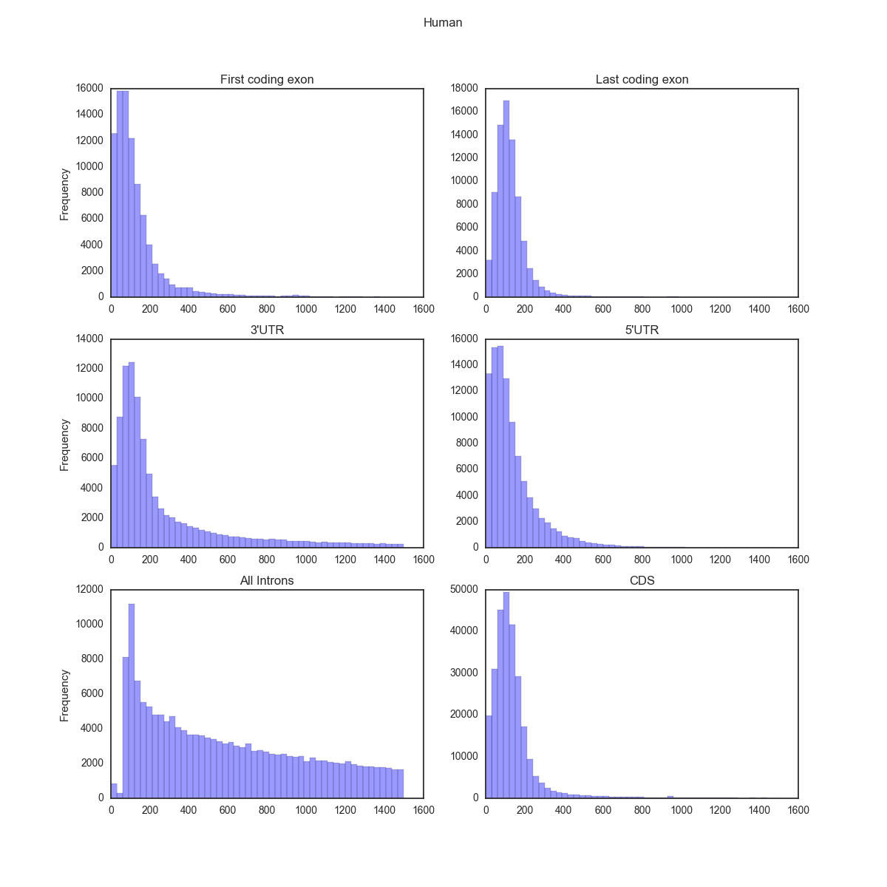
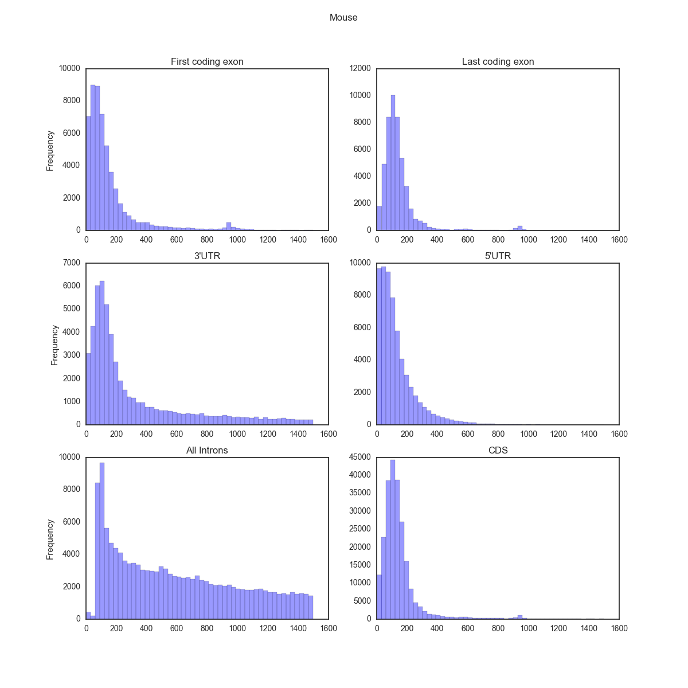

# gencode_regions
Extract 3'UTR, 5'UTR, CDS, Promoter, Genes from Gencode files

## Depedencies
   
- r>=3.2.1
- [GenomicFeatures](http://bioconductor.org/packages/release/bioc/html/GenomicFeatures.html)

## Run

```{bash}
./create_regions_from_gencode.R <path_to_GFF/GTF> <path_to_output_dir>
```

Will create `exons.bed, 3UTR.bed, 5UTR.bed, genes.bed, cds.bed` in `<output_dir>`


## Example

- Download GFF/GTF(GRCh37, v25, comprehensive, CHR) from gencodegenes.org:

```{bash}
   wget ftp://ftp.sanger.ac.uk/pub/gencode/Gencode_human/release_25/gencode.v25.annotation.gff3.gz \
   && gunzip gencode.v25.annotation.gff3.gz
```

- Create regions:

```{bash}
./create_regions_from_gencode.R gencode.v25.annotation.gff3 /path/to/GRCh37/annotation
```

## First exons, Last exons

We use [`GenePred`](https://genome.ucsc.edu/FAQ/FAQformat#format9) format to make the process a bit simple.

 - Download [gtfToGenePred](http://hgdownload.cse.ucsc.edu/admin/exe/)
 - Convert gtf to GenePred:
 
     ```{bash}
     gtfToGenePred gencode.v25.annotation.gtf gencode.v25.annotation.genepred
     ```
     
 - Extract `first exons`:
 
     ```{bash}
     python genepred_to_bed.py --first_exon gencode.v25.annotation.genepred
     ```
     
 - Extract `last exons`:
 
     ```{bash}
     python genepred_to_bed.py --last_exon gencode.v25.annotation.genepred
     ```

## Size distribution

#### Human


#### Mouse



## Confused about exons and UTRs?

This should be helpful:

[Source: Wikipedia](https://en.wikipedia.org/wiki/File:Gene_structure_eukaryote_2_annotated.svg)

or probably this:

[Source: Biostar](https://www.biostars.org/p/47022/)


## TODO

- Get $n^{th}$ exon/intron


